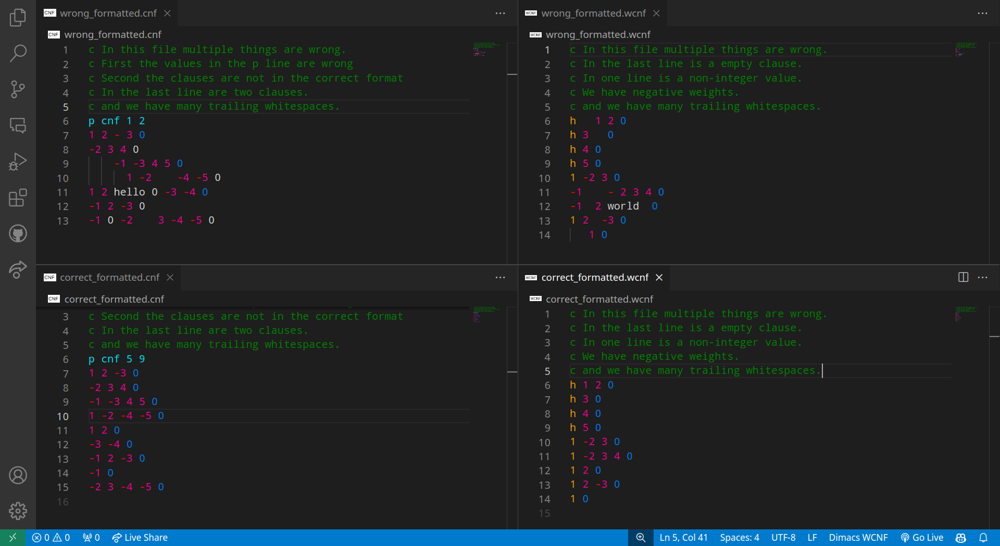

# DIMACS Extension for Visual Studio Code

## Overview
The Dimacs extension for Visual Studio Code enhances the editing experience for DIMACS files, specifically CNF (Conjunctive Normal Form) and WCNF (Weighted Conjunctive Normal Form) files. It provides features such as syntax highlighting and code formatting tailored for DIMACS format, making it easier to work with these files in Visual Studio Code.

I designed the extension to my own needs, addressing errors I commonly do when editing DIMACS files. I prefer it when the editor automatically formats the file upon saving with `Ctrl + S`. I also like to have syntax highlighting to make the file more readable.

## Introduction to DIMACS format
The DIMACS format is a standard file format for representing satisfiability problems.
It is widely used in the field of computer science and operations research for encoding problems such as Boolean satisfiability (SAT) and weighted MAX-SAT.
The format is simple and human-readable, making it easy to work with and understand.

```bash
c
c start with comments
c
p cnf 3 2
1 3 0
-1 2 0
```

This is the DIMACS format for the formula: 
```bash
(x1 ∨ x3) ∧ (¬x1 ∨ x2)
```
Each line represents a clause, with the last number being 0 to indicate the end of the clause.

For more information on the DIMACS format, see the following links:
- [SAT Competition 2009: Benchmark Submission Guidelines](http://www.satcompetition.org/2009/format-benchmarks2009.html)
- [MaxSAT Evaluation 2023 Rules](https://maxsat-evaluations.github.io/2023/rules.html)

## Dependencies
- Visual Studio Code
- Python 3.x

## Installation
To install the Dimacs extension, follow these steps:
1. Open Visual Studio Code.
2. Go to the Extensions view by clicking on the square icon in the sidebar or pressing `Ctrl+Shift+X`.
3. Click on the three dots in the upper-right corner of the Extensions view and select "Install from VSIX...".
4. Select the file `dimacs-0.0.1.vsix` from the artifact folder and click "Install".

Or install it from the terminal with the following command:

```bash
code --install-extension dimacs-0.0.1.vsix
```
(Make sure to be in the same directory as the `dimacs-0.0.1.vsix` file)

## Usage
Once the Dimacs extension is installed, it automatically activates when you open a file with a `.cnf` or `.wcnf` extension. For the extension to work properly, Visual Studio Code must be trusted to run the extension. This can be done by clicking on the "Trust the author" button in the notification that appears when opening a file.
Take a look at the files in the `example` folder to see the extension in action.

## Features
- Syntax highlighting: Highlights literals, comments, weights and the terminating zero of DIMACS format files for better readability. It's also possible to toggle a comment (using the standard `Ctrl + /` shortcut).
- Code formatting: Automatically formats DIMACS when saving the file, ensuring that the file is correctly formatted according to the DIMACS format specification. 



## Usage Tips
> [!CAUTION]
> It's important to note that a wrongly formatted DIMACS file can be interpreted in many different ways. Consequently this can potentially lead to unintended outcomes. Use with caution!

## Customization
The formatting can be turned off by setting the `dimacs.enableAutoFormat` setting to `false` in the Visual Studio Code settings menu.

## Standalone Formatting
The formatting can also done without using the Visual Studio Code extension by running the python script `dimacs_formatter.py` witch can be found in the repository. The script can be run with the following command:
```bash
python3 dimacs_formatter.py <path_to_file>
```

> [!NOTE] 
> The script is not intended for standalone use, but rather in the extension for Visual Studio Code. The standalone script primarily serves demonstration and runtime analysis purposes. It's important to note that the primary tool that was used to generate CNF or WCNF files should output correctly formatted files. This script is not meant to replace such a tool; rather, it serves as a tool to make the editing of DIMACS files during debugging or testing processes more comfortable.

## Output
The script does not create a new file, but rather modifies the existing DIMACS file. But it prints the time it took to format the file. In Visual Studio Code the time will be displayed in the debug console.

## License
The Dimacs extension is licensed under the [MIT License](LICENSE), which permits users to use, copy, modify, merge, publish, distribute, sublicense, and/or sell copies of the software.
